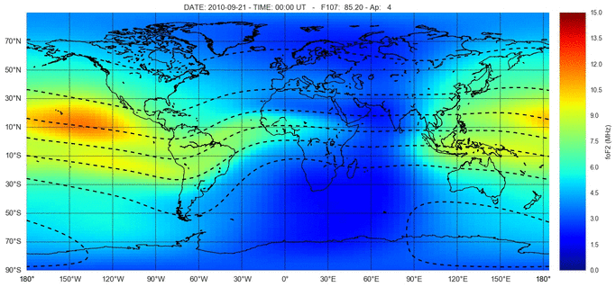
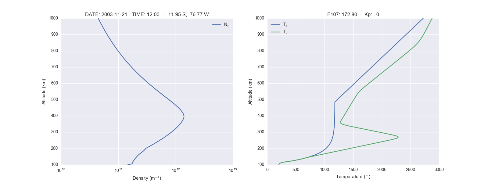
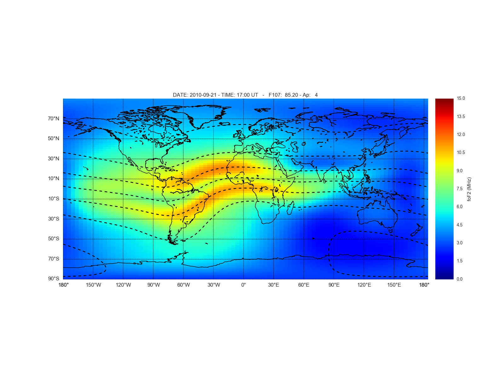

# IRI2016 ionosphere model from Python and Matlab

A Python interface to the International Reference Ionosphere (IRI) 2016 model.

## Install

Any Fortran compiler will do. 
IRI2016 has been tested with compilers including:

* Gfortran 5, 6, 7, 8
* Intel `ifort`
* PGI `pgf90`

Install Gfortran by:

-   Linux: `apt install gfortran`
-   Mac: `brew install gcc`
-   [Windows](https://www.scivision.co/windows-gcc-gfortran-cmake-make-install/)

and then from your Python &ge; 3.6 install (such as [Miniconda](https://conda.io/miniconda.html)):

    pip install iri2016

or:

    python -m pip install -e .

## Usage

### Height-profile

plot density and temperatures vs [altitude](AltitudeProfile.py)

### Latitudinal profile

plot densities and height at the peak of F2, F2, and E regions vs [geographic latitude](LatitudeProfile.py)

### GMT profile

plot densities and height at the peak of F2, F2, and E regions vs universal [time](TimeProfile.py)

### Height vs GMT

plot Ne, Te, and Ti as a function of height and universal [time](scripts/iri2DExample01.py)

### Latitude vs Longitude

plot of foF2 a function of geographic latitude and [longitude](scripts/iri2DExample02.py)

## Notes

These commands are not normally needed unless you want to work with the Fortran code more directly.

### Fortran compile

    cd bin
    cmake ../fortran

    cmake --build -j .

    ctest -V

### f2py compile

The function DFRIDR() inside igrf.for dynamically calls other functions.
This is something f2py can't access directly, so we tell f2py not to
hook into function DFRIDF() with the end statement `skip: dfridr`:

    f2py -m iri2016 -c iriwebg.for irisub.for irifun.for iritec.for iridreg.for igrf.for  cira.for iriflip.for  skip: dfridr

### f2py: IGRF only

    f2py -m igrf -c irifun.for igrf.for skip: dfridr
