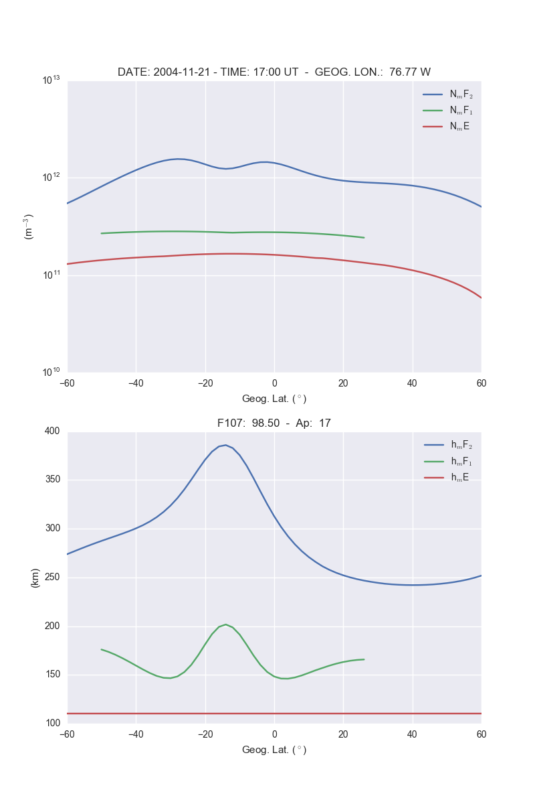
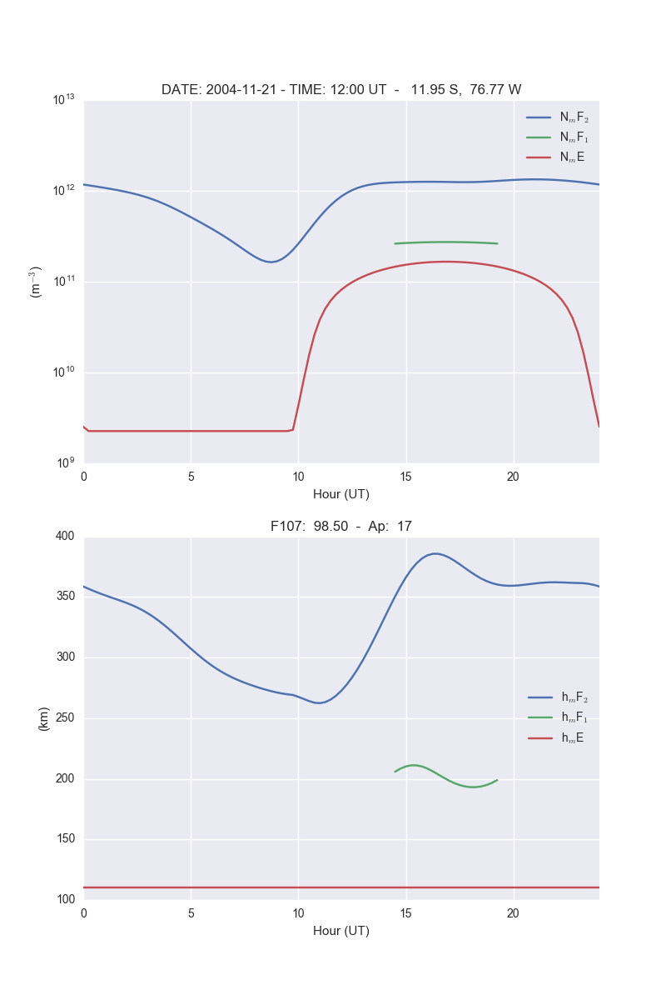
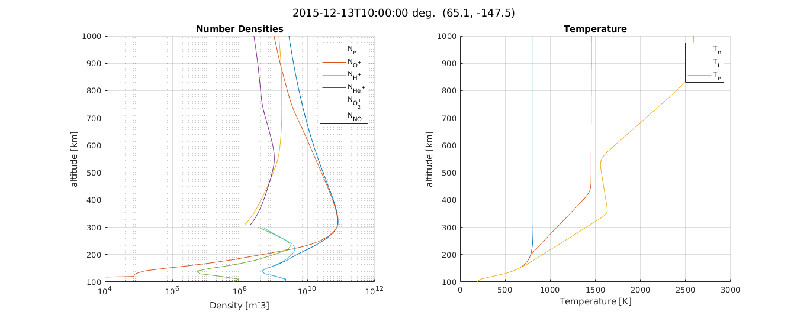

[](https://doi.org/10.5281/zenodo.240895)
[](https://travis-ci.org/scivision/IRI2016)
[](https://coveralls.io/github/scivision/IRI2016?branch=master)
[](https://ci.appveyor.com/project/scivision/pyiri2016)
[](https://pypi.python.org/pypi/iri2016)
[](http://pepy.tech/project/iri2016)


# IRI2016 ionosphere model from Python and Matlab


Python and [Matlab](#matlab) interfaces to the International Reference Ionosphere (IRI) 2016 model.

NOTE: November 2018 we are temporarily recommending a workaround where we directly use a command-line interface to IRI2016, as there may be `f2py` bugs interfacing to the massive Fortran 77 IRI2016 codebase, even with the latest IRI2016.

1. compile IRI2016 command-line driver program:
   ```sh
   cd bin
   
   cmake ../src
   
   cmake --build .
   ```
   For Windows, the 2nd line is:
   ```sh
   cmake -G "MinGW Makefiles" -DCMAKE_SH="CMAKE_SH-NOTFOUND" ..
   ```
2. drive the simulation via a seamless command line interface:
   
   * Matlab / GNU Octave: [matlab/RunIRI2016.m](./matlab/RunIRI2016.m)
   * Python: [RunIRI2016.py](./RunIRI2016.py)


---

Methods below unverified, please use workaround above.

## Install

Any Fortran compiler will do. 
IRI2016 has been tested with compilers including:

* Gfortran 5, 6, 7, 8
* Intel `ifort`
* PGI `pgf90`

Install Gfortran by:

-   Linux: `apt install gfortran`
-   Mac: `brew install gcc`
-   [Windows](https://www.scivision.co/windows-gcc-gfortran-cmake-make-install/)

and then from your Python &ge; 3.6 install (such as [Miniconda](https://conda.io/miniconda.html)):

```sh
pip install iri2016
```

or:
```sh
git clone https://github.com/scivision/iri2016
cd iri2016

python -m pip install -e .[tests]
```
    
## Usage

* Height-profile: plot density and temperatures vs [altitude](./AltitudeProfile.py)
  
* Latitudinal profile: plot densities and height at the peak of F2, F2, and E regions vs [geographic latitude](./LatitudeProfile.py)
  
* GMT profile: plot densities and height at the peak of F2, F2, and E regions vs universal [time](./TimeProfile.py)
  
* Height vs GMT: plot Ne, Te, and Ti as a function of height and universal [time](./examples/example01.py)
  
* Latitude vs Longitude: plot of foF2 a function of geographic latitude and [longitude](./examples/example02.py)
  
  
### Matlab
Many Python programs--including IRI2016--are readily accessible from Matlab.
Here's what's you'll need:

1. [Setup Python &harr; Matlab interface](https://www.scivision.co/matlab-python-user-module-import/).
2. Install IRI2016 in Python as at the top of this Readme.
3. From Matlab, verify everything is working by from the `iri2016/` directory:
   ```matlab
   runtests('tests')
   ```
4. Use [iri2016.m](./matlab/iri2016.m) function to access IRI2016 quantities.  See [RunIRI2016.m](./matlab/RunIRI2016.m) for simple example use / plots.

CAVEAT: due to old-fashioned Fortran 77 techniques, Matlab needs to be restarted to run more than one IRI2016 scenario.
This is also true of the Fortran code itself, and Python.
What we do in Python is call a Python script over and over, inputting distinct parameters.
This can be done from Matlab like the [BatchIRI2016.m](./matlab/BatchIRI2016.m) script, enhanced to call an easier/faster Python script.
Let us know.



## Data files

`iri2016/iri2016/data/index/{apf107,ig_rz}.dat` are 
[regularly updated](http://irimodel.org/indices/).
Currently we don't auto-update those.

## Direct compilation

These commands are not normally needed unless you want to work with the Fortran code more directly.

### Fortran compile

```sh
cd bin
cmake ../src

cmake --build .

ctest -V
```

### f2py compile

The function DFRIDR() inside igrf.for dynamically calls other functions.
This is something f2py can't access directly, so we tell f2py not to
hook into function DFRIDF() with the end statement `skip: dfridr`:

```sh
f2py -m iri2016 -c iriwebg.for irisub.for irifun.for iritec.for iridreg.for igrf.for  cira.for iriflip.for  skip: dfridr
```

### f2py: IGRF only

```sh
f2py -m igrf -c irifun.for igrf.for skip: dfridr
```

## Notes

* [2016 presentation](https://doi.org/10.5281/zenodo.1493021)
